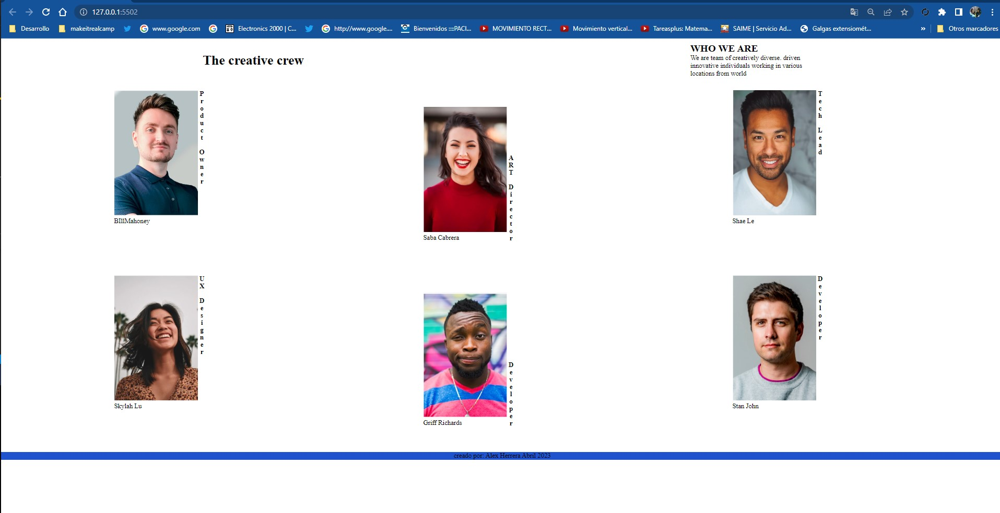
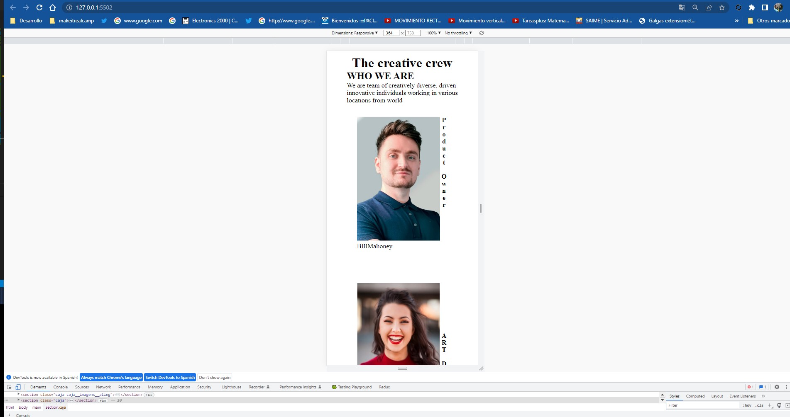

# Make It Real - My Team Page

This is a solution to the Sprint 1 HTML 1 project of the Make It Real course.

## Table of contents

## Table of contents

- [Overview](#overview)
  - [The challenge](#the-challenge)
  - [Screenshot](#screenshot)
- [My process](#my-process)
  - [Built with](#built-with)
  - [What I learned](#what-i-learned)
  - [Continued development](#continued-development)
  - [Useful resources](#useful-resources)
- [Author](#author)
- [Acknowledgments](#acknowledgments)


## Overview :
-It is a program where SASS is practiced, to get to that, have the bases of css and html.
We applied to the project display-flex, selectors, and the css was also compiled through Live Sass Compiler.

### The challenge

Users should be able to:

-work with BEM and SASS,
nest the styles thanks to SASS, identify how to put the classes to HTML to take the styles

### Screenshot





## My process
- CSS: ⭐️⭐️
- HTML: ⭐️⭐️


### Built with

- Semantic HTML5 markup
- CSS custom properties
- Flexbox
- Mobile-first workflow

### What I learned


I practiced and learned sass, how to compile, also how to nest the classes to place styles, handle display flex.

I leave an example of how we take the classes in html and in sass.

-example:

```html
    <section class="caja caja__imagens__aling"> 
         <div class="caja__imagens">
            
            <section class="caja__imagens__piefoto">Saba Cabrera</section>
         </div>
         <section class="caja__imagens__latera">ART Director</section>
    </section> 
```
``` scss
.caja{
    width: 100%;
    padding: 20px;
    
    display: flex;
    justify-content:center;
    
    &__imagens{
        
       
    }
    &__imagens__latera{
        
        color:black;
        font-weight:bold;
        writing-mode: vertical-rl;
        text-orientation: upright;
        
   }
   &__imagens__aling{
    padding: 60px 0px;
    display: flex;
    align-items:end;
    
   }
}
```
### Continued development
- I will continue practicing to have a better command of HTML and SASS, consulting my mentors studying on my own so that every day I improve my knowledge.

 ### Useful resources
- https://classroom.makeitreal.camp/courses/82/topics/353/progress -- This helped me I will use it in the future.
- https://sass-lang.com/install
- https://flexboxfroggy.com/#es
- https://developer.mozilla.org/es/docs/Web/CSS/text-orientation

## Author

- email - [guialexander1@gmail.com]
- Twitter - [@guialexander1](https://www.twitter.com/guialexander1)
- github: [guialexander](https://github.com/)

## Acknowledgments

-I want to thank the make it real family since it has given me a new vision of my working life to improve and get out of the comfort zone and know that we can give more than what we already know
